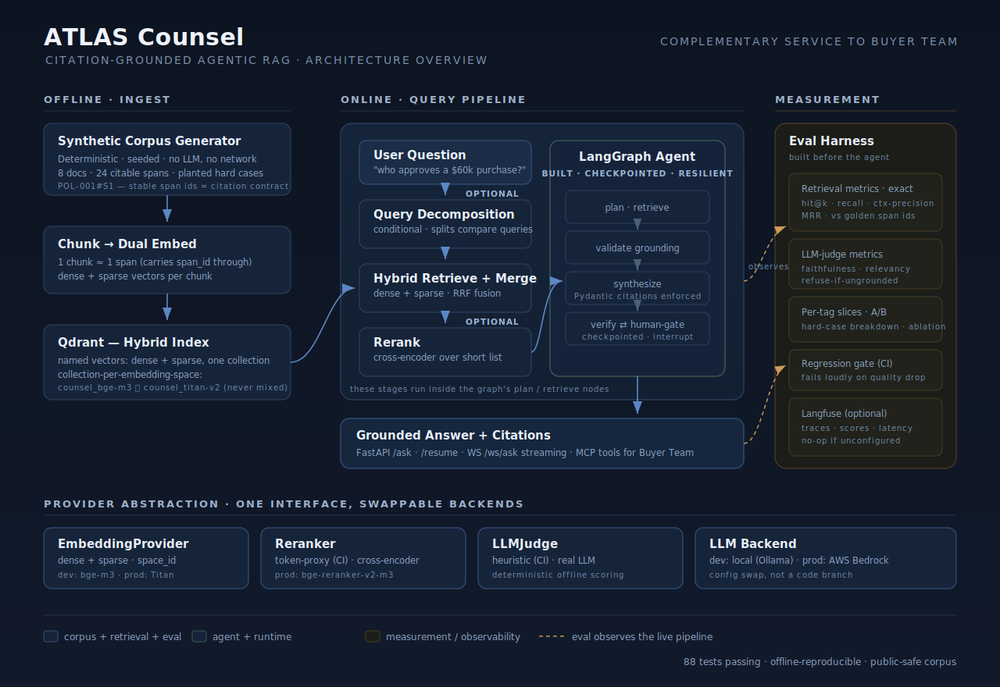
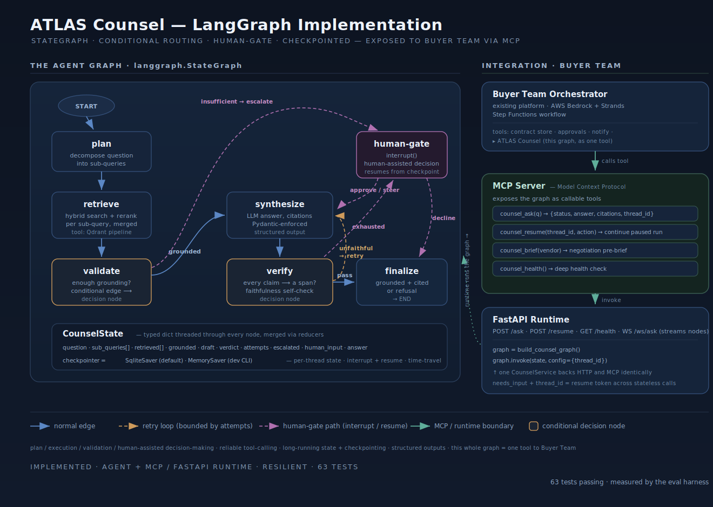

# ATLAS Counsel

Citation-grounded agentic RAG over a synthetic procurement corpus. A
complementary knowledge service to the Buyer Team platform: a multi-agent
(LangGraph) RAG pipeline with hybrid retrieval, reranking, citation grounding,
and a measured eval harness.

This first slice ships the **corpus generator + golden eval set** plus a
**hybrid retrieval layer** (dense + sparse, RRF fusion) over it.

## Quickstart

```bash
uv sync --extra dev
atlas-corpus                          # generate the corpus
uv run pytest                         # 83 tests, no external services

# full suite (service + Qdrant resilience):
uv sync --extra dev --extra service --extra qdrant
uv run pytest                         # 85 tests

# hybrid retrieval, offline (in-memory, no Qdrant):
uv run python -m atlas_counsel.ingest --dry-run

# hybrid retrieval against real Qdrant:
docker compose up
uv sync --extra qdrant
uv run python -m atlas_counsel.ingest --url http://localhost:6333
uv run pytest tests/test_qdrant_integration.py -v
```

## Retrieval design

- **Hybrid, native.** One collection per chunk holds a dense vector and a
  sparse (lexical) vector. Queries fuse both channels with Reciprocal Rank
  Fusion (RRF). Sparse rescues exact tokens — `$25,000`, `99.5%` — that a
  semantic dense model smears together. `tests/test_retrieval.py` proves a
  real fusion win on a query where the channels disagree.
- **Vector-space safety by construction.** Each embedding provider declares a
  `space_id`; the collection name is derived from it (`counsel_bge-m3`,
  `counsel_titan-v2`). A local-dev index and a Bedrock-prod index are
  physically separate collections — you cannot query one space against the
  other by accident.
- **Provider abstraction.** `EmbeddingProvider` is a Protocol yielding dense +
  sparse per text. `HashingEmbedder` is a deterministic offline stand-in for
  CI; real bge-m3 (dev) and Titan (prod) providers implement the same
  interface. Dev/prod is a config swap, not a code branch.
- **Citations survive retrieval.** Chunks map 1:1 to spans and carry the
  `span_id` through Qdrant payloads, so a result always cites `POL-001#S1`.

## What the corpus contains

- **8 documents / 24 citable spans**: procurement policies, vendor MSAs, a
  negotiation log. Each span has a stable id (e.g. `POL-001#S1`) that the
  golden set and, later, the retriever cite directly.
- **8 golden Q/A items** spanning three answer types:
  - `grounded` — answer lives in specific span(s)
  - `multi_hop` — requires combining spans across documents
  - `unanswerable` — answer is **absent by design**; the agent must refuse

### Planted hard cases (each tagged, so eval can slice on them)

| Trap | Where | Tests |
| ------ | ------- | ------- |
| Contradiction | AcmeCloud 99.9% vs NorthLink 99.5% uptime | cross-document reasoning |
| Threshold precision | POL-001 ($50k) vs near-duplicate POL-002 ($25k) | reranker precision |
| Unanswerable | supplier-gift question (Q-006) | refuse-if-ungrounded |
| Anti-splitting | $120k split question (Q-007) | policy reasoning |

## Reproducibility

The corpus is fully seeded and template-driven — no LLM calls, no network.
Same seed in, byte-identical corpus out. That is what makes the downstream
eval numbers trustworthy.

## Evaluation harness

Measured before any agent exists, so every later change is regression-checked.

```bash
uv run python -m atlas_counsel.eval        # aggregate + per-tag breakdown
uv run python -m atlas_counsel.eval --ab   # A/B two embedding configs
uv run python -m atlas_counsel.eval --meta # judge bias report

- **Retrieval metrics** (no LLM, exact): hit@k, context recall, context
  precision (AP-style), MRR — scored against the golden set's known
  `supporting_span_ids`.
- **Answer metrics** behind an `LLMJudge` protocol: a deterministic
  `HeuristicJudge` runs in CI; inject an LLM-backed judge locally for
  faithfulness / answer-relevancy at full fidelity.
- **Refuse-if-ungrounded** is a first-class scored dimension. Refusal is
  decided by *lexical grounding overlap*, not retrieval score — RRF fusion
  scores are rank-based and carry no absolute relevance signal, so a score
  threshold cannot tell answerable from unanswerable.
- **Per-tag slicing** reports each planted hard case (threshold-precision,
  contradiction, unanswerable…) separately, proving the hard cases are
  handled — not just the easy ones.
- **A/B table** across two retrievers (two embedding providers) is the
  harness's native output — the artifact the provider abstraction exists for.
- **Langfuse** export is optional (`uv sync --extra langfuse`, set
  `LANGFUSE_*` env); a silent no-op otherwise so CI never depends on it.
- **Meta-evaluation** (`--meta`) detects judge bias without an external LLM:
  perturbation-based fluency and confidence-formatting bias tests, plus
  Spearman-rank retrieval-judge correlation. `HeuristicJudge` serves as the
  ~zero-delta baseline; a real LLM judge would reveal actual bias.
- A **regression gate** (`tests/test_eval.py`) locks in current aggregate
  quality so future changes fail loudly instead of degrading silently.

## Advanced retrieval: rerank + query decomposition

Two optional stages compose around the base hybrid retriever via
`RetrievalPipeline`, each independently toggleable so the eval harness can
attribute any metric change to a specific stage (ablation):

```text
query --(decompose?)--> sub-queries --retrieve+merge--> --(rerank?)--> top_k
```

- **Reranking.** `Reranker` protocol. `TokenInteractionReranker` is a
  deterministic offline proxy for CI (query-doc token interaction + a
  proportional phrase-adjacency bonus, scored without ever consulting golden
  spans). `CrossEncoderReranker` wraps bge-reranker-v2-m3 for production
  (`uv sync --extra rerank`).
- **Query decomposition.** Conditional by design — a query is split only when
  it names >= 2 known entities AND carries a comparison cue, so simple queries
  pass through untouched (tested). Multi-hop questions retrieve per-entity and
  merge, recovering the starved side.

### Honest ablation

```bash
uv run python -m atlas_counsel.ablation
```

On the current small corpus, first-stage hybrid nearly saturates retrieval, so
the **offline lexical proxies show no net gain** (rerank slightly lowers
precision; decomposition is net-neutral). This is reported, not hidden. The
stages ship as correct, unit-tested infrastructure; the production
cross-encoder and an LLM decomposer are the implementations expected to win,
and this same harness is how you confirm it locally. The proxies are
deliberately NOT tuned toward the golden spans to manufacture an improvement.

## The agent: LangGraph StateGraph

The orchestration layer. A compiled `StateGraph` with conditional routing, a
checkpointed human-gate, and a bounded verify/retry loop. Replaces the eval
stub answerer and the PR3 lexical-refusal proxy with real graph logic.

```bash
uv run python -m atlas_counsel.agent --q "who approves a $60,000 purchase?"
uv run python -m atlas_counsel.agent --q "policy on supplier gifts?" --decline
```

Flow:

```text
plan -> retrieve -> validate
validate --grounded--> synthesize        --insufficient--> gap_analyze
gap_analyze -> retrieve                  (bounded re-retrieval, max 2)
validate --insufficient & exhausted--> human_gate
synthesize -> verify
verify --pass--> finalize -> END
       --unfaithful & attempts<MAX--> synthesize   (bounded retry)
       --unfaithful & exhausted--> human_gate
human_gate --steer--> synthesize         --decline--> finalize(refuse)
```

- **Structured outputs / citation grounding.** `synthesize` emits a Pydantic
  `DraftAnswer` whose every `Claim` carries a `span_id`; `verify` rejects any
  claim citing a span that wasn't retrieved. A hallucinated citation is caught,
  not shipped — proven by `test_hallucination_is_bounded_and_escalates`.
- **Human-assisted decisions.** `human_gate` uses LangGraph `interrupt()`; the
  run pauses, the caller resumes with `Command(resume=...)` to steer or
  decline. State survives the pause via the checkpointer.
- **Gap-aware iterative retrieval.** When validation finds insufficient context,
  a `gap_analyze` step extracts missing-topic tokens and re-retrieves (bounded at
  `MAX_GAP_ITERATIONS=2`). Retrieved chunks accumulate across iterations so no
  evidence is discarded. Only when the gap loop is exhausted does the agent
  escalate to the human gate.
- **Bounded loops.** The verify→synthesize retry is capped at `MAX_ATTEMPTS`,
  then escalates — no unbounded LLM spinning.
- **Provider abstraction.** `LLMProvider` protocol with an offline
  `TemplateLLM` for CI (cites only retrieved spans, never fabricates) and real
  Ollama/Bedrock injected locally. Checkpointer is injected too: SqliteSaver
  (default) or MemorySaver (dev CLI).
- **Measured, not asserted.** Run over the golden set the agent matches the
  stub: correct refusal on the unanswerable item, 7/7 answerable not wrongly
  refused. The one citation miss (Q-003) is the known PR4 retrieval weakness a
  real cross-encoder addresses — left visible, not hidden.

### Buyer Team integration

The compiled graph is exposed as four MCP tools (`counsel.ask`, `counsel.resume`,
`counsel.brief`, `counsel.health`) so Buyer Team's Strands orchestrator calls it
as one tool among its own. All tools accept a `tenant_id` for multi-tenant
isolation. Deployed remotely over Streamable HTTP or locally over stdio (see
`buyer-team-mcp.example.json`).

## Runtime: FastAPI + MCP

The graph exposed over two transports, both thin wrappers over one
`CounselService` — so HTTP and MCP behave identically (proven by
`test_mcp_and_http_agree`).

```bash
uv sync --extra service
uv run uvicorn atlas_counsel.service.api:app    # HTTP on :8000
uv run python -m atlas_counsel.service.mcp_server      # MCP stdio server
```

**REST**

- `POST /ask {tenant_id, question}` → `{status, thread_id, answer, citations[]}`
- `POST /resume {tenant_id, thread_id, action, guidance?}` → same shape
- `WS /ws/ask` → streams `{event:"node", node}` per step, then a terminal
  `result` / `needs_input` frame (the JD's streaming requirement)

**Interrupt across stateless calls.** The agent pauses at the human-gate via
LangGraph `interrupt()`, but HTTP/MCP are request/response. So a paused run
returns `status="needs_input"` plus a `thread_id`; a second `/resume` call
continues it. The checkpointer carries state across those two independent
calls — the core integration design.

**MCP tools** (what Buyer Team calls): `counsel_ask`, `counsel_resume`,
`counsel_brief`, `counsel_health`. All accept `tenant_id` for multi-tenant
isolation. See `buyer-team-mcp.example.json` for the client entry — supports
local (stdio) and remote (Streamable HTTP) configurations.

## Observability: OpenTelemetry

Silent no-op when the OTEL SDK is not installed or `OTEL_EXPORTER_OTLP_ENDPOINT`
is not set — CI never depends on it. When configured, exports OTLP traces via a
`BatchSpanProcessor`.

**Env vars:**

| Variable | Purpose | Default |
| ---------- | --------- | --------- |
| `OTEL_EXPORTER_OTLP_ENDPOINT` | OTLP collector endpoint | (disabled) |
| `OTEL_SERVICE_NAME` | Service name in traces | `atlas-counsel` |

**What's traced:**

- Every HTTP request (FastAPI auto-instrumentation)
- `counsel.ask` / `counsel.resume` / `counsel.astream` — manual spans with
  `tenant_id`, `question_len`, `thread_id`, and action attributes
- `tenant.create` — graph compilation time per tenant
- MCP tool calls (via the HTTP transport traces)

**Setup:**

```bash
uv sync --extra otel
OTEL_EXPORTER_OTLP_ENDPOINT=http://localhost:4318 \
  uv run uvicorn atlas_counsel.service.api:app
```

## Architecture





## Deployment

AWS ECS Fargate with Qdrant Cloud. Per-tenant SQLite checkpoints on EFS.

```bash
# Infrastructure
cd infra
cp terraform.tfvars.example terraform.tfvars  # set your qdrant_url
terraform init && terraform apply

# CI/CD deploys on push to main (build → ECR → ECS).
```

The deployed service exposes both HTTP REST and MCP on the same port:

- `GET  /health` — health check
- `POST /ask {tenant_id, question}` — answer with citations
- `POST /resume {tenant_id, thread_id, action}` — resume paused run
- `GET  /mcp` — MCP Streamable HTTP endpoint
- `WS   /ws/ask` — streaming progress

All endpoints require a `tenant_id` (defaults to `"default"` for single-tenant
use). See `buyer-team-mcp.example.json` for local and remote MCP client configs.

## Layout

```text
src/atlas_counsel/
  _tokenize.py         # shared tokenizer (used by reranker, judge, answerer)
  telemetry.py          # OpenTelemetry setup (OTLP exporter, silent no-op when off)
  corpus/              # synthetic corpus generator + golden set
  chunking.py          # span -> chunk, preserving citation ids
  embeddings.py        # EmbeddingProvider protocol + HashingEmbedder
  retrieval.py         # Retriever protocol, RRF fusion, in-memory hybrid
  qdrant_store.py      # production Qdrant hybrid retriever (retry + timeout)
  ingest.py            # CLI: build -> chunk -> index
  eval/                # metrics, judge protocol, runner, A/B, meta-eval, Langfuse
  rerank.py            # Reranker protocol + offline proxy + cross-encoder
  decompose.py         # conditional query decomposition
  pipeline.py          # composed decompose->retrieve->merge->rerank
  ablation.py          # CLI: measure each stage's effect
  agent/               # LangGraph StateGraph: state, nodes (incl. gap_analyze), graph, llm
  service/
    api.py             # FastAPI REST + WebSocket + mounted MCP
    core.py            # CounselService (transport-agnostic)
    mcp_server.py      # MCP tools + remote transport
    tenants.py         # TenantRegistry (per-tenant SqliteSaver)
tests/
infra/                 # Terraform: ECS, ALB, EFS, ECR
.github/workflows/     # CI (test) + CD (deploy)
Dockerfile
docker-compose.yml     # local Qdrant
```
